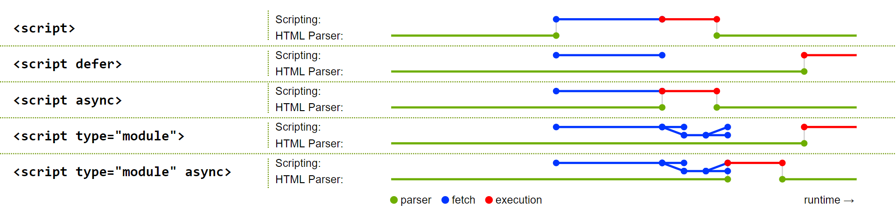

# DOM

While a browser receives an HTML source file, it starts to parse it piece by piece to construct an object representation of the document called the DOM ([Document Object Model](https://www.w3.org/DOM/)) tree. Simultaneously, the DOM is being converted into a _render tree_, which represents what eventually is being painted. The document can start being rendered and painted in the browser before it is fully loaded. Unless it is blocked by CSS or JavaScript.

When the parser comes across CSS code, the rendering process is being blocked until the CSS is fully parsed.
Similar as before, the browser now constructs a CSSOM ([CSS Object Model](https://www.w3.org/TR/cssom-1/)) tree which associates the styles to each node. After parsing the CSS, a combination of the DOM and CSSOM are being used for continuing creating the _render tree_.

Even though the rendering process can be blocked by CSS, the DOM is still being parsed. Unless it comes across JavaScript. When the parser reaches a `<script>` tag, the parsing stops, and the script is being executed.
This is the reason that a JavaScript file needs to be placed after the appearance of a referenced element in the script.

Previously, it has been best practice to always include the `<script>` tags at the end of the document to make sure that all the elements are available and to not block the rendering and therefore painting process of the browser.

Nowadays, there are other options to avoid that JavaScript is being parser blocking. For example:

```html
<script async src="script.js"> // Script is executed asynchronously, while the page continues parsing
```

```html
<script defer src="script.js"> // Script is executed when the page has finished parsing
```

> This image summarizes the many different approaches to load JavaScript code.
> 
> More information can be found in the [HTML5 specification](https://html.spec.whatwg.org/multipage/scripting.html)


## Manipulating the DOM

Basically, the DOM is an interface for HTML (and XML) documents which represents the page. It is dynamic, and the browsers provide an API to read and change the content, structure, and style of the document via JavaScript.
This allows for changing parts of the website without the need of a refresh and therefore a repaint of the whole page.

JavaScript has access to a global object. In a browser, `window` is the global object and represents the window/tab of the browser in which the script is running. One of its property is `window.document` which serves as an entry point to the parsed DOM tree.

> Because `window` is the global object, there is no need to reference its properties (e.g. `document`) via `window`. The property name can be used directly as the script will figure out the global object at runtime.

The `document` interface can now be used to manipulate the DOM.

As an example let's create an HTML file:

```html
<!DOCTYPE html>
<html>
  <head>
    <title>My first web page</title>
  </head>
  <body>
    <h1>Hello, world!</h1>
    <p>How are you?</p>
  </body>
</html>
```

The browser will parse this file to the following DOM:


This DOM can now be manipulated via the `document` interface in JavaScript:

```js
const $h1 = document.querySelector('h1'); // Accessing the <h1> element
console.log($h1.textContent);             // Reading: Hello, world!
$h1.textContent = 'Hello, Puerro!';       // Manipulating

const $button = document.createElement('button'); // Creating new Element
document.body.appendChild($button);               // Changing DOM structure
```

### TextContent vs. InnerText vs. InnerHTML

There are three different ways to access the content of a DOM element.

1. **`element.textContent`**: represents the text content of a node as it is in the DOM. Therefore, it doesn't include the HTML tags but keeps the content of non-visible elements. For example, the content of `<script>` or `<style>` tags.
2. **`element.innerText`**: similar to `textContent` but uses CSS knowledge and only returns visible content. This has the disadvantages that reading a value with `innerText`triggers a reflow to ensure up-to-date computed styles. This can be computationally expensive and should be avoided when possible.
3. **`element.innerHTML`**: represents the HTML source of the element. It should only be used when the intention is to work with HTML markup. Misusing it for text is not optimal for performance and it is vulnerable to XSS attacks.

### Creating Elements

The `element.innerHTML` method allows to build up a nested structure using the HTML markup language relatively easy.

```js
document.body.innerHTML = `
  <input type="number" />
  <button type="button" onclick="console.log('Clicked')">Do it!</button>
`;
```

This gets slightly more challenging for appending or modifying nodes to an already existing DOM as all its child elements are being re-parsed and recreated completely. This means that saved references to nodes are no longer pointing to the supposed elements.

Re-parsing the whole structure of the element is also bad for the performance.

```js
document.body.innerHTML = '<h1>Tomato</h1>';
const $h1 = document.querySelector('h1');
document.body.innerHTML += '<p>Lean as a Leek</p>'; // Whole body element is being reparsed
$h1.textContent = 'Puerro';			    // Reference does not point to the DOM instance
```

There is a solution for this called [`element.insertAdjacentHTML`](https://developer.mozilla.org/de/docs/Web/API/Element/insertAdjacentHTML) which does not re-parse all its child elements.

```js
document.body.innerHTML = '<h1>Tomato</h1>';
const $h1 = document.querySelector('h1');
document.body.insertAdjacentHTML('beforeend', '<p>Lean as a Leek</p>'); // No complete reparsing
$h1.textContent = 'Puerro';				                // Reference still works
```

This combination between `innerHTML` and references is not very readable. Plus, when dealing with registering event listeners as well, it can get complicated. If a reference to a created element should exist at a later time, it is advisable to use the `document.createElement` method.

```js
const $input = document.createElement('input');
$input.setAttribute('type', 'number');
$input.setAttribute('value', 1);

const $button = document.createElement('button');
$button.setAttribute('type', 'button');
$button.textContent = 'Go';
$button.addEventListener('click', _ => console.log($input.value));

document.body.append($input, $button);
```

Puerro provides an [abstraction](https://github.com/robin-fhnw/IP5-Puerro/tree/master/src#createdomelement) to make it more convenient to create elements.

```js
const $input = createDomElement('input', { type: 'number', value: 1 });
const $button = createDomElement('button', { type: 'button', click: _ => console.log($input.value) }, 'Go');
document.body.append($input, $button);
```

## Event-Driven Actions

After the HTML has been parsed, rendered and painted, the browser is usually waiting for user interactions.
For this to work the browser uses an event-driven programming model to notify the JavaScript code about what's happening on the page.

There are a lot of different events. For example, when the DOM is finished with loading, clicking elements, typing on the keyboard, scrolling and many more.

In order react to an event, `Event Handlers` are used. Event handlers are functions which are being called from the browser when an event occurs.

When an event is fired, the first parameter an handler receives is an [`Event`](https://developer.mozilla.org/en-US/docs/Web/API/Event) object which contains useful information and methods. The most used are:

- `target`: A reference to the target to which the event was originally dispatched.
- `type`: The name of the event.
- `stopPropagation()`: Stops the propagation of events further along in the DOM.
- `preventDefault()`: Cancels the event.

### Register Event Handler

To register an event there are three possibilities.

#### Inline Event Handlers

The most legacy but direct way is to register event handlers directly in the HTML markup.

```html
<button onclick="console.log('Button clicked');"></button>
```

But especially for larger projects this is considered a bad practice as it is hard to read and maintain because it doesn't separate the view from the actions. It also requires that the functions are exposed globally, which is pollution to the global namespace.

#### DOM on-Event Handlers

A better way is to register the event handlers in the JavaScript code. It is similar to the inline event handlers, but it respects the separation of concerns and the scope is more controllable.

```js
$button.onclick = event => console.log('Button clicked');
```

A drawback with this approach is that it is only possible to assign one listener to each event.

#### Using `addEventListener()`

The most modern approach is to use the `element.addEventListener()` function. It allows to register as many event handlers as needed.

```js
$button.addEventListener('click', event => console.log('Button clicked'));
```

With this approach it is also possible to remove listeners with the `element.removeEventListener()` function.
Another advantage is the ability to choose between event bubbling and capturing.

### Bubbling and Capturing

When nodes are nested, a user interaction can trigger multiple events.
Two different models exist to handle this:

- **Bubbling** (default): The event propagates from the clicked item up to all its parents, starting from the nearest one.
- **Capturing**: The outer event handlers are fired before the more specific handler.

With the following example, the events bubble. Meaning they are propagated upwards.

```html
<body>
  <div>
    <button>Click Me!</button>
  </div>

  <script>
    const $div    = document.querySelector('div');
    const $button = document.querySelector('button');

    $div   .addEventListener('click', _ => console.log('DIV clicked'));
    $button.addEventListener('click', _ => console.log('BUTTON clicked'));

    // Console Output:
    // BUTTON clicked
    // DIV clicked
  </script>
</body>
```

To make sure that the `DIV` event listeners triggers first, the methods `useCapture` parameter needs to be true.
All the event handlers with `useCapture` enabled run first (top down), afterwards the bubbling handlers (bottom up).

```js
$div.addEventListener('click', _ => console.log('DIV clicked'), true);
```

To complete stop the propagation, the handler can call the `stopPropagation()` method on the event object.

```js
$button.addEventListener('click', event => {
  console.log('BUTTON clicked');
  event.stopPropagation();
});
```

### Forms

Building forms is a widely used pattern for web applications. HTML provides a `<form>` tag, which allows to group interactive controls together for submitting data to a server. When a form is being submitted, an HTTP Request with the specified method is sent to the specified resource. With this traditional approach, the page always will be refreshed and new rendered based on the response.

This approach is acceptable if we want to display a completely different view after submitting the form.
However, for modern web application this is usually not desirable. Instead, it is better to use an Ajax request in the background without affecting the page and to manipulate the DOM based on the response.

Nevertheless, using the `<form>` tag has many advantages and should still be used for grouping interactive controls:

- It improves the logical structure of the HTML.
- It increases the accessibility for screen readers.
- It provides a better user experience on mobile phones.
- It has the ability to access its [elements](https://developer.mozilla.org/en-US/docs/Web/API/HTMLFormElement/elements) conveniently.
- It has the ability to easily [reset](https://developer.mozilla.org/en-US/docs/Web/API/HTMLFormElement/reset) its elements.

In order to use the `<form>` tag without it being submitted, an event handler has to be registered for the form's submit event. In this handler the method `event.preventDefault()` can be executed to prevent the form from submitting.

```html
<body>
  <form>
    <input name="name" />
    <input name="age" type="number" />
    <button>Submit</button>             <!-- Submits Form -->
    <button type="reset">Reset</button> <!-- Resets Form  -->
  </form>
  <script>
    const $form = document.querySelector('form');
    $form.onsubmit = event => {
      // Proccess form elements at will (e.g. Ajax Request, Validation, DOM manipulation)
      console.log(event.target.name.value); // Easy access on name value
      console.log(event.target.age.value);  // Easy access on age value
      event.preventDefault();               // Prevent form submitting
    };
  </script>
</body>
```

> A button can have 3 different types: `submit`, `reset` and `button`.
> The default type is `submit` which will attempt to submit form data when clicked.
> When the intention is to use a button without a default behaviour, explicitly specify `type="button"`.

> A `<form>` can also be submitted by pressing _enter_ or via JavaScript. Therefore, using a `<button type="button">` with a click event handler won't be enough.
> Plus receiving the target form in the event is a huge benefit.

## Testability

When event handler functions receive events, they can in turn manipulate the DOM.


For a handler function to manipulate the DOM, references to the elements which have to be manipulated are needed.
Those references can either be already available in the surrounding scope or can be created in the function itself.

```js
const handleEvent = event => {
  const $element = document.querySelector('div');
  // manipulate $element
};

$element.addEventListener('click', handleEvent);
```

> With the help of eta reduction, the parameter can be removed when there is only one argument or when using curried functions.
> `x => foo(x)` can be shortened to `foo`

This gets problematic when the intention is to test this unit, since the DOM might not be available.
Furthermore, this approach can quickly become difficult to maintain.

A better approach for a simplified testability is to receive the nodes which are being manipulated as a parameter.

The element which fires the event does not have to be passed as an argument because it is available through `event.target`.

When new elements are being created, it is a good practice to return them for a more convenient testing.

```js
import { createDomElement } from 'puerro';

export { appendInput, changeLabel };

const appendInput = ($input, $output) => _ => {
  const $element = createDomElement('p', {}, $input.value);
  $output.append($element);
  return $element; // return for testing purposes
};

const changeLabel = $button => event => {
  $button.textContent = 'Save: ' + event.target.value;
};
```

To use the handler functions, they simply have to be registered with the needed references as arguments.

```js
import { changeLabel, appendInput } from './example';

const $input  = document.querySelector('input');
const $button = document.querySelector('button');
const $output = document.querySelector('output');

$button.addEventListener('click', appendInput($input, $output));
$input .addEventListener('input', changeLabel($button));

```

To use the handler functions for testing, the needed elements need to be created.

```js
import { describe, createDomElement } from 'puerro';
import { appendInput, changeLabel } from './example';

describe('Testable Units', test => {
  test('appendInput', assert => {
    // given
    const $input  = createDomElement('input', { value: 'Puerro' });
    const $output = createDomElement('div');

    // when
    const $element = appendInput($input, $output)(); // event object not needed

    // then
    assert.is($output.children.length, 1);
    assert.is($element.tagName, 'P');
    assert.is($element.textContent, 'Puerro');
  });

  test('changeLabel', assert => {
    // given
    const $input  = createDomElement('input',  { value: 'Puerro' });
    const $button = createDomElement('button', { type: 'button' });

    // when
    changeLabel($button)({ target: $input }); // mocking event object

    // then
    assert.is($button.textContent, 'Save: Puerro');
  });
});
```

The above example can be found in the [Puerro Examples](../examples/dom).

## Use Cases

This style of programming with direct DOM manipulations within the event handler functions is easy and intuitive.
It can be used for various tasks:

- Dynamic informational websites.
- Reactive content without side effects.
- Experimenting/Prototyping.
- Simple Web application without many changing parts.
- Server-Side rendered web applications.

### Advantages

- Zero dependencies.
- Little code.
- Easy to understand.
- Fast.

## Problems / Restrictions

This approach is getting harder to maintain when either frontend state is being introduced or there are many changing elements. This is especially true when the application starts growing.

When an event triggers a lot of changes, a reference to each dependent element needs to be managed. If multiple elements need to be updated constantly and in short time frames, it can start to become expensive to constantly query and update the DOM.
Furthermore, when updates depend on data stored in the DOM, the decapsulation between view and model is not given.

For large application there probably will be redundant code and all DOM related accesses are scattered through the code.

### Disadvantages

- Difficult to scale and maintain.
- Hard to structure/organize.
- Redundant code.
- Scattered DOM manipulations.
- Very specific.
- State lives in the view.

[← Introduction](01-Introduction.md) | [Virtual DOM →](03-Virtual-DOM.md)
