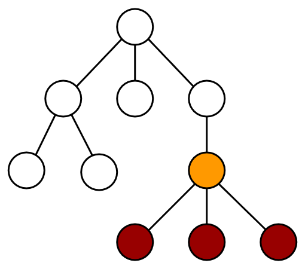

# Virtual DOM

When the DOM was invented in 1998, websites were built and managed differently. It was not common to regularly modify the structure of the page via the DOM API. Constantly updating multiple elements on a page can get very chunky, hard to maintain and even performance intensive.

This is a simple example to change a table item and adding a new row:

```html
<body>
  <table>
    <tbody>
      <tr class="row">
        <td class="item">Tomato</td>
      </tr>
    </tbody>
  </table>

  <script>
    const $tbody = document.querySelector('tbody');
    const $td = $tbody.querySelector('td');
    $td.textContent = 'Puerro';

    const $newTr = document.createElement('TR');
    $newTr.setAttribute('class', 'row');

    const $newTd = document.createElement('TD');
    $newTd.setAttribute('class', 'item');
    $newTd.textContent = 'Huerto';

    $newTr.append($newTd);
    $tbody.append($newTr);
  </script>
</body>
```
Most of the time it is easier to perform more expensive operations and updating larger parts of the DOM.
This includes the re-rendering of nodes which don't change. As seen in the last chapter, this has some disadvantages, as references and registered event listeners are getting lost. Plus, it can be vulnerable for XSS attacks if the content is not being sanitized first.

```js
const $tbody = document.querySelector('tbody');
$tbody.innerHTML = `
  <tr class="row">
    <td class="item">Puerro</td>
  </tr>
  <tr class="row">
    <td class="item">Huerto</td>
  </tr>
`;
```

The virtual DOM solves the problem of needing to frequently update the DOM. It is not an official specification, but rather a new method of interfacing with the DOM. It can be thought of as an abstraction or copy of the DOM.

Basically, the virtual DOM is just a regular JavaScript object representing HTML markup. It can be manipulated freely and frequently without using the DOM API. Whenever needed, it can execute the specific changes it needs to make to the original DOM. 

Puerro has its own implementation of the virtual DOM. [Check it out](../src/#virtual-dom).

## Creating a Virtual DOM

Since a virtual DOM element is just a JavaScript object, which can be created like this:

```js
const vDOM = {
  tagName: "tbody",
  attributes: {},
  children: [
    {
      tagName: "tr",
      attributes: { class: "row" },
      children: [
        { tagName: "td", attributes: { class: "item" }, children: ["Puerro"] }
      ]
    },
    {
      tagName: "tr",
      attributes: { class: "row" },
      children: [
        { tagName: "td", attributes: { class: "item" }, children: ["Huerto"] }
      ]
    }
  ]
};
```

Using Puerro simplifies this a lot:

```js
const vDOM = h('tbody', {},
  h('tr', { class: 'row' }, h('td', { class: 'item' }, 'Puerro')),
  h('tr', { class: 'row' }, h('td', { class: 'item' }, 'Huerto'))
);
```

> `h` stands for _hyperscript_ and is a common abbreviation for building virtual elements.

Since the virtual DOM will be modified frequently, it is a good practice to have a function to create the virtual DOM with the changing parts as parameters.

```js
const createVDOM = items => h('tbody', {}, 
  items.map(item =>  h('tr', { class: 'row' }, h('td', { class: 'item' }, item)))
);
```

### White-Spaces

Spaces, tabs, or line breaks are all white spaces which are used to format code. In HTML markup, these white spaces are normally only for readability purposes and are not impacting the layout of a page.

However, there are exceptions. In case there are white spaces between inline elements, they are getting collapsed and displayed as a single space.

```html
<button>Puerro</button>
<button>Huerto</button>
```

The newline will be represented and displayed as a text node with a space in the final layout. 


Without the white spaces, there is no gap between the elements.

```html
<button>Puerro</button><button>Huerto</button>
```


> How exactly white spaces are handled can be read in the [CSS Text Module Level 3 Specification](https://www.w3.org/TR/css-text-3).

This needs to be taken into consideration when creating virtual elements since white spaces are not being created.
A possible workaround could be to use an advanced templating language like JSX. 

#### JSX (JavaScript XML)

JSX is a pre-processor step which allows to write virtual DOM elements with the HTML/XML syntax. Basically, it compiles XML syntax into the above described notation using the `h` function before using it as a JavaScript file.

This project does not go into more detail on how it works and how to use it.

## Rendering

In order use the virtual DOM, there has to be a way to convert virtual elements into DOM nodes. Therefore, a `render` function is introduced. This function recursively travels the virtual DOM and uses the DOM API to build up nodes.

Instead of directly manipulating the DOM with its API, a virtual DOM can be created including the needed changes. 
The only direct interaction with the DOM is when the newly rendered nodes are being attached to it.

One way for this to happen is as a response to an event.

```js
const handleClick = $table => _ => {
  const items = ['Puerro', 'Huerto']; // fetching items from API's, DOM elements or others
  const vDOM = createVDOM(items);
  $table.replaceChild(render(vDOM), $table.firstElementChild);
  return vDOM;
}
```

This, however, doesn't differ a lot of using `$table.innerHTML`. All the nodes are still getting re-created from scratch and previously held references are lost. It could also lead to a bad performance when dealing with huge DOM trees.

This illustration shows how rerendering works, when the orange node changed but every node is getting rerendered. 


### Identity Problem

Another problem when completely rerendering a large amount of elements is that they lose their identity. This is noticeable when a selected element or an element containing temporary state is being rerender. In that case, the focus is being lost which is not good from a usability point of view.

This could for example be the case inside a form, when the structure of the form changes based on the input and the whole form is being rerendered.

One possible solution for this problem is to save the identity before rerendering and manually applying it back afterwards. Another approach is to use diffing and only update elements which need to change.

## Diffing

The real advantage of the virtual DOM can be seen when diffing is being used to only specifically update the parts and elements which have been changed.

With diffing the idea is to find the virtual nodes which have been changed and only rerender the parts of the tree which are necessary. This illustration shows how diffing works when the orange node has changed and only the colored nodes which need to be updated are getting rerendered.



In order to make this work, a diffing algorithm is needed to check the changes between two virtual DOM's and applying the changes to the actual DOM. Puerro has it's own [diffing](../src/#diffing) implementation.

```js
diff($parrent, newVDOM, oldVDOM);
```

This implies that a _current_ or _initial_ version of the virtual DOM must exist. Since the state of this _current_ version lives in the DOM, it needs to be converted into a virtual DOM first. Puerro provides the `toVDOM` function for this purpose.

```js
const handleClick = $table => _ => {
  const vDOM = createVDOM(['Puerro', 'Huerto']);
  diff($table, vDOM, toVDOM($table.firstElementChild))
  return vDOM;
}
```

The result is that there are no more direct DOM interactions because the virtual DOM abstractions can handle them.
Furthermore, only elements which really need to be changed are getting rerendered.

## Testability

Using virtual elements results in a big benefit for testability. Instead of returning a DOM element and using the DOM API to test the content of the rendered view, the virtual DOM abstraction can be returned and tested with common JavaScript object approaches.

In case there is a specific need to test the DOM tree directly, the `render` function can be used to convert the virtual DOM into a normal DOM.

```js
describe('vDOM', test => {
  test('createVDOM', assert => {
    // given
    const items = ['Puerro', 'Huerto'];

    // when
    const vDOM = createVDOM(items);

    // then
    assert.is(vDOM.children.length, 2);
    // possibility to interact via DOM API
    assert.is(render(vDOM).querySelector('td').textContent, 'Puerro'); 
  });
});
```

The described example can be found in the [Puerro Examples](../examples/vdom).

## Use Cases

The virtual DOM is useful when multiple elements need to be changed simultaneously or often.
Instead of directly selecting and manipulating DOM nodes, the structure of the view can be written in a more descriptive way and the access to the DOM API is getting delegated to the general implementation of the virtual DOM.

Some possible use cases are:

- SPA (Single Page Applications) with huge DOM trees.
- When the DOM needs to change constantly and a lot.
- To display dynamically received content (e.g. over an API) without the need to store state.

### Advantages

- No direct DOM manipulations.
- Declarative programming style.
- Reusability / less redundancy.
- Better testability.

## Problems / Restrictions

The virtual DOM is an abstraction of the DOM. Operating on the virtual DOM is in addition to the DOM manipulations, which creates a computation overhead. This is especially the case for the diffing algorithm.

As in most abstractions, simplicity comes with the price of reduced flexibility. Meaning that it is not possible to handle every single edge case scenario with the virtual DOM.

Furthermore, the virtual DOM requires to completely build up a virtual view with all its sub elements, even though most of the content might never change and could be coded directly into the HTML view.

Handling state in the frontend is still not controlled in a structured way and updates on the view need to be triggered manually.

### Disadvantages

- Computation overhead.
- Reduced flexibility.
- Less readable than HTML markup.
- Missing whitespaces between inline elements.
- Possible problems with the identity of elements.
- State lives in the view.

[← DOM](02-DOM.md) | [State Management →](04-State-Management.md)


