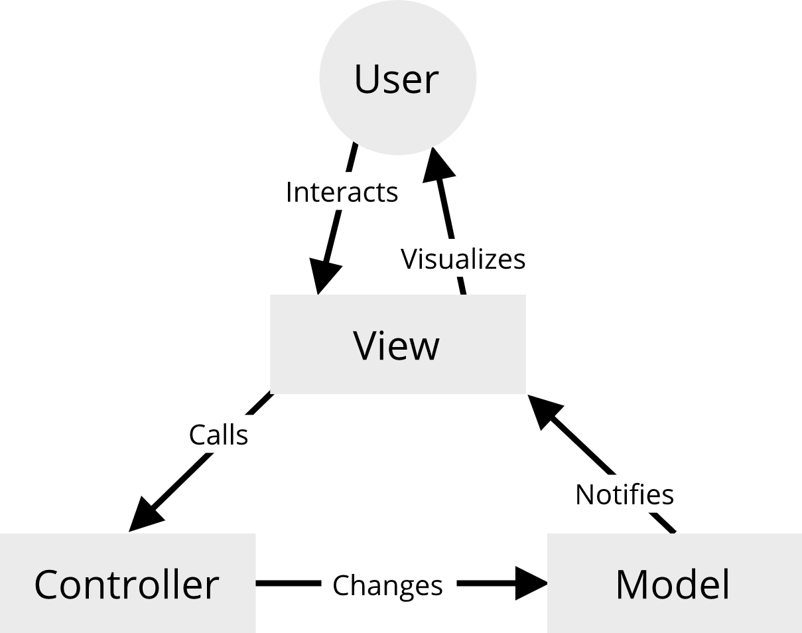
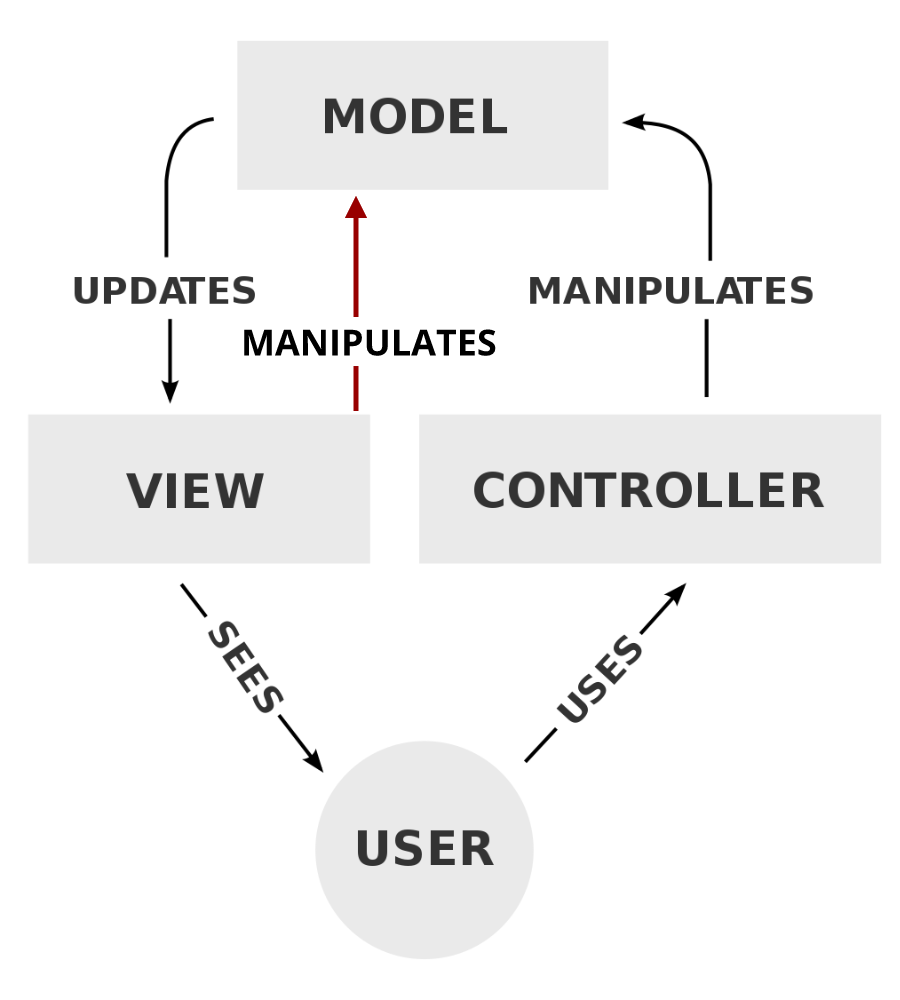

# MVC
MVC has been around in the software development world for quite a while and it is a well-established way to create software. It is a type of application architecture which focuses very much on the separation of concerns.

## The MVC Way

An MVC (Model-View-Controller) application is, as the name suggests, divided into _Model_, _View_ and _Controller_. The following illustration represent how the data and events flow through the three components:



### Models

A Model defines and stores data and is not concerned with how this data gets presented to the user. A model has to be observable, so when the data changes, the views get notified and can take action accordingly. 

Puerro provides [observables](../src#observable) which are very useful for the definition of models. The following is an example of a model in an MVC approach with pure JavaScript (without frameworks, only the observable abstraction from Puerro):

```js
import { Observable } from 'puerro';

const Model = ({ name = '', age = 0 } = {}) => ({
    name: Observable(name),
    age: Observable(age),
});
```

### Views

The view is used to present the model to the user. It is the only component of a frontend MVC application which interacts with the DOM. The view subscribes to changes of the model and takes the required actions in the DOM to represent the new model state.

Users interact with the view which leads to events being fired from the DOM. Relevant DOM events are being listened to by the view and in turn passed to the controller if the user interaction requires a change to the model. The following code snippet is a view which could take the previous example model to represent data. The view also interacts with a controller which is introduced in the next chapter.

```js
const View = (model, controller, $form, $output) => {
    const render = () =>
    	($output.innerText = `${model.name.get()} - ${model.age.get()}`);
    
    // View-Binding
    $form.name.addEventListener('input', evt => controller.setName(evt.target.value));
    
    $form.increase.addEventListener('click', controller.increaseAge);
    $form.decrease.addEventListener('click', controller.decreaseAge);
    
    // Model-Binding
    model.name.onChange(render);
    model.age. onChange(render);
}
```

Since the view does not concern itself with how the page is rendered, it can be done in different ways. In the previous example the DOM was manipulated directly, but this is just one way of handling the view layer. It can for example also be rendered with the virtual DOM which ensures all the benefits it brings. The following example shows how the virtual DOM can be integrated into a view:

```js
const View = (model, controller, $form, $output) => {
    const view = () => h('div', {},
                           h('div', {}, model.name.get()),
                           h('div', {}, model.age.get())
                          );
    
    const render = name => {
        $output.replaceChild(renderVDOM(view()), $output.firstChild);
    }
    
    // same as before...
}
```

### Controllers

The controller sits between models and views and is responsible for handling updates to the model. All actions which change the model have to go through the controller. Because all actions are handled by the controller, the application becomes very predictable and easier to reason about.

A controller for our example could look like the following: 

```js
const Controller = model => {
    const setName = name => {
        if (null == name || name.length === 0) {
            // handle invalid model state
        }
        model.name.set(name);
    }
    
    const setAge = age => {
        model.age.set(age);
    }
    
    const increaseAge = () => setAge(model.age.get() + 1);
    const decreaseAge = () => setAge(model.age.get() - 1);
    
    return {
        setName,
        increaseAge,
        decreaseAge,
    }
}
```

If the MVC architecture is combined with the revealing module pattern as shown in the above example, it is possible to use private functions like `setAge`. With this the interface of the controller is clearly defined and actions exposed to the view can be limited.

The controller is also the only place in the MVC architecture where side effects (for instance API calls) should be implemented.

### Bringing it all Together

The Model, View and Controller can be separated into their own files and initialized in a central JavaScript file which is requested by the HTML.

```js
const model = Model();
const controller = Controller(model);
const view = View(model, 
                  controller,
                  document.getElementById('form'),
                  document.getElementById('output')
                 );
```

As evidenced by this example, MVC can generate some boilerplate code which seems over the top for small applications. But especially when the application scales, the advantages become very visible. The business logic is contained in one place and the model cannot be changed except through this business logic. Especially compared to the direct manipulation of the DOM and application state from anywhere in the code. This approach makes the application way more predictable and easier to understand.

## Bidirectional Binding

Data and user inputs always flow unidirectionally in MVC. This makes the application easier to reason about and more predictable, since the model cannot be changed from anywhere. 

Many modern frontend frameworks like Vue.JS and Angular (not React) work with bidirectional bindings of data. This is intuitive at first but as an application grows it can become very unpredictable. The model can be changed from anywhere and business logic has to be enforced with different approaches, for example in Vue.JS using [watchers](https://vuejs.org/v2/guide/computed.html#Watchers).

MVC does not permit bidirectional binding by design which might feel like a restriction sometimes, but it is essential to prevent bugs and keep the codebase understandable and maintainable. If it would allow bidirectional binding the graph would look like this:



This would defeat the whole purpose of the controller, by leaving it out. With this architecture we can never be quite sure that all the necessary business logic is executed.

## Global State

The models hold the business data (or state) of our application. What if there are multiple separate MVC constructs which share a common state, but also have a state of their own? In this case, MVC in the frontend gets a bit tricky but there are a few ways to share state between controllers and models. 

### Client-Side Persistence Systems

In the backend data is usually persisted with a session or a database. With that in mind, there is an argument to be made to store the shared data in a persistence system which works on the client, for instance the `localStorage`. The downside to that is, that those systems are not reactive. This means that the values they store are not observable. Observable values are essential to ensure that the views get updated if an entry is changed. That is why those systems are not an optimal solution to handle global state.

### Global Data Store

An alternative is to create a reactive global data store, which emits events, when data changes. This global store has to be accessible from every view and controller to retrieve and set values.

The Puerro library offers the [`ObservableObject`](../src#observableobject) constructor function. An `ObservableObject` has the same functionality as an `Observable` with the addition that each property is separately subscribable as well.

```js
import { ObservableObject } from 'puerro';

const myGlobalData = ObservableObject({ todos: [], userLoggedIn: false });

// subscribe to todo changes
myGlobalData.subscribe('todos', (newVal, oldVal) => { 
	console.log(newVal); // logs todos
});

// subscribe to all changes to the store
myGlobalData.onChange((newVal, oldVal) => {
  console.log(newVal.userLoggedIn); // logs userLoggedIn
});

// add a todo:
myGlobalData.set({ todos: [...myGlobalData.get().todos, 'My new todo'] });
```

The rules of MVC still apply to the global store. It can only be changed from the controllers and not form anywhere else. 

The downside to this approach is, that it can get confusing for a developer to figure out if data is stored in the global store or in the local model. It might seem obvious during the initial development of an application but can be very hard to manage while maintaining a codebase with a global store.

### Multiple Views

MVC does not restrict one model and controller pair to be bound to exactly one view. A different approach to provide shared data between views is by injecting a model-controller pair into multiple views. 

One could for instance extend the example used in the previous chapters and create a different view for the input and output of the application:

```js
const InputView = (model, controller, $form) => {
    // View-Binding
    $form.name.addEventListener('input', evt => controller.setName(evt.target.value));
    
    $form.increase.addEventListener('click', controller.increaseAge);
    $form.decrease.addEventListener('click', controller.decreaseAge);
}

const OutputView = (model, controller, $output) => {
    const render = () =>
    	($output.innerText = `${model.name.get()} - ${model.age.get()}`);
    
    // Model-Binding
    model.name.onChange(render);
    model.age. onChange(render);
}
```

With multiple views, the rendering of different parts of our application can be splitted, but if the application gets larger the controller can get incomprehensible.

## Testability

Business logic (in form of the controller) can be unit tested in a very efficient manner, since it is separated from the rest of the application. In previous examples we often had to mock DOM elements to test logic which can be tedious during the initial development but especially during maintenance.

```js
import { describe }   from 'puerro';
import { Model, Controller } from './example';

describe('AppController', test => {
    const model = Model({ name: 'Test', age: 99 });
    const controller = Controller();
    
    test('setName empty', assert => {
    		// when
       	controller.setName('');
        
        // then
        assert.is(/* assert the error was properly handled */);
    });
});
```

Since in this case the intention is to only test business logic, there is not even a need to import the view because it doesn't matter how the data gets rendered into the DOM.

## Use Cases

MVC can be used in many different situations but it shines the most in applications with a high amount of business logic. Since the business logic only lives in the controllers, maintaining and extending this logic becomes way easier than with other approaches. This also increases the overall stability of a system.

Possible scenarios are:

- Medium to large data driven applications.
- Applications which need to have a high maintainability.
- Business logic heavy applications.

### Advantages

- Separation of concerns.
- Business logic and view are independently testable.
- High maintainability.
- Minimal amount of redundant code.

## Problems / Restrictions

MVC requires quite a bit of boilerplate code, as well as some sort of observable. This can be an overkill for small applications and interactions.

### Disadvantages

- Dependencies.
- Boilerplate code.
- Handling global state is hard.

[← State Management](04-State-Management.md) | [Conclusion →](06-Conclusion.md)