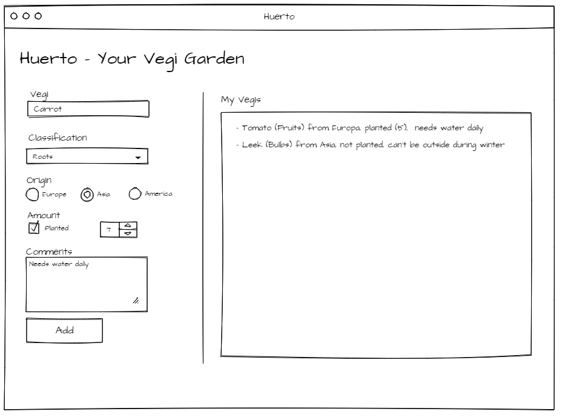
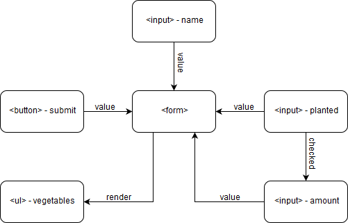

# Season 02 - Getting Input

| Implementation (Demo)           | Test Results           |
| ------------------------------- | ---------------------- |
| [02 - Getting input](demo.html) | [Tests 02](tests.html) |

## Conversation

> > **Customer**: Wow! That was quick!
>
> > **Developer**: Sure thing, that's because I didn't had to use a framework for it.
>
> > **Customer**: A framewhat? Never-mind. Tell you what, three tomatoes have already grown on my tomato vine. Now I also want to know how many pieces of each vegetable I own. Could you let me add the amount as well?
>
> > **Developer**: For sure! Anything else?
>
> > **Customer**: Perfect! Yes, since I also add vegetables which I didn't plant yet, could you make sure, that I only need to fill out the amount if I already planted it? I would also like to save some additional information about my vegis. Like the classification, origin and maybe some additional comments. Oh, and before I forget.. It took me a while to figure out that I need to press _Enter_ to submit my entry. Could you please add an _Add_ button for me?
>
> > **Developer**: Okey, let me see.. So it should look something like this:  The _amount_ input will disappear if _planted_ is unchecked.
>
> > **Customer**: Exactly, you're the best!

## Development Process

In this iteration the main challenge is that we receive more input from the user.
This leads to the consideration to group the received data together.

### [Form](research/form-tag)

In HTML there is a `<form>` tag, which allows to group controls together for submitting the data to a server.
This results in using a server-side script that handles the form data.
As discussed in the last iteration, the goal is to use client-scripting with Ajax calls instead.

Nevertheless, using a `<form>` tag has many advantages, some of them are the following:

- Improved logical structure of the HTML
- Ability to [reset](https://developer.mozilla.org/en-US/docs/Web/API/HTMLFormElement/reset) the whole form
- Ability check the validity of all form elements if HTML5 validation is used
- Ability to get all form [elements](https://developer.mozilla.org/en-US/docs/Web/API/HTMLFormElement/elements) within the form without knowing the elements specifically
- Increased accessibility for screen readers
- Better usability on smartphones (changing keyboard to support submit)

### [Grouping with Object](research/object-grouping)

A consideration is also to group the input in a javascript object.
But as we are currently just displaying the entered data it's easier to have a direct toString implementation.

### [Click vs Submit Event](research/form-submit)

As before with the event listener on a single input field, we could add an event listener on the button and access the form inside of this event.
With this approach, the form would still be submitted, and the page refreshed. Therefore, we need to prevent the form from submitting.

This can be achieved like this:

```js
const $form = document.querySelector('form');
$form.onsubmit = event => event.preventDefault(); // prevent form from submitting.
```

Furthermore, this submit event contains the target form as well and is therefore a better place to handle the form fields than on the button's click event.

```js
const $form = document.querySelector('form');
$form.onsubmit = event => {
  event.preventDefault(); // prevent form from submitting.
  console.log(event.target.input.value); // handle form fields
};
```

### [Conditionally show fields](research/conditional-elements)

For now, the fastest and easiest way is to listen to events of one field and with that information toggle the visibility of others.

#### Diagram

Diagram of how the form inputs interact with each other.


## Result

If receiving multiple inputs from the user, the HTML `<form>` tag is the best option.
For using it in a client-side scripting manner, the default submitting action needs to be disabled and handled separately by modifying the submit event.
While the input data is just displayed and not processed further, an object abstraction is not yet needed.
